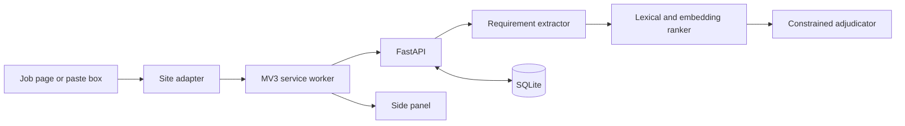

# Job Match Extension — Delivery Plan

Last updated: September 20, 2026

## 1. Product outcome

From a supported job page or pasted description, the tool should return a
ranked list of role-family resume bases, explain the requirement coverage,
identify meaningful gaps, and suggest evidence-backed bullet swaps. It should
also report PDF parsing health separately from match coverage.

The product must not invent an “ATS score.” Its two user-facing measures are:

1. **Requirement coverage** — a traceable weighted score with evidence.
2. **Parse check** — whether important resume content survives text parsing.

### P0 success scenario

Given a saved Greenhouse or Lever job description and nine resume bases, a
developer can call one endpoint and receive the ranked bases, evidence for each
covered requirement, missing requirements, and a warning when the top results
are too close to distinguish confidently.

## 2. Scope boundaries

### In scope

- Chrome Manifest V3 side panel, service worker, options page, and content
  scripts.
- Local FastAPI backend and SQLite store.
- Structured job-requirement extraction through Gemini, with cached results.
- Deterministic lexical/synonym matching, followed by embeddings and one
  constrained adjudication call.
- Markdown and PDF resume ingestion, bullet bank, parse checks, and run history.
- Paste-text fallback for unsupported or hostile job sites.

### Deferred

- Chrome Web Store publication, multi-user accounts, billing, and mobile UI.
- Automatic resume rewriting without user review.
- Scraping resume.lol or bypassing authentication/access controls.
- Workday and iCIMS site-specific scraping until the static-site flow is stable.

## 3. Guiding constraints

- The Gemini key stays in the backend; extension source contains no provider
  secrets.
- A match must cite a requirement and resume evidence. No citation means gap.
- Role-family bases are ranked; 130+ near-duplicate company variants are not.
- Required requirements count twice preferred ones by default.
- Evidence in experience/project bullets has a 1.0 placement multiplier;
  skills-only evidence has 0.6.
- Results are cached by job-description hash and versioned by resume digest.
- Scores within three points are presented as a close match, not a confident
  winner.
- Real resume content and application history remain local and ignored by Git
  unless the user deliberately sanitizes and adds them.

## 4. Architecture and contracts

### Main API operations

| Endpoint | Purpose | P0 |
| --- | --- | --- |
| `GET /health` | Liveness and build metadata | Yes |
| `POST /v1/matches/rank` | Rank supplied resumes against extracted requirements | Yes |
| `POST /v1/jobs/extract` | Convert raw job text to typed requirements | Next |
| `POST /v1/resumes/import` | Import Markdown/PDF and version its contents | P0 |
| `GET /v1/resumes` | List role-family bases and versions | P0 |
| `POST /v1/parse-checks` | Report PDF extraction health | P1 |
| `POST /v1/suggestions` | Recommend cited bullet-bank swaps | P1 |
| `GET /v1/runs` | Query prior match runs | P2 |

### Core records

- `Resume`: stable id, name, role family, source format, content digest, version.
- `Bullet`: stable id, resume/source, section, text, keywords, families.
- `Job`: source URL, company/title, raw-text hash, extracted requirements.
- `Requirement`: text, keywords, kind, priority, weight.
- `Coverage`: requirement, verdict, score, placement, cited bullet id.
- `MatchRun`: job/extractor/scorer/resume versions plus ranked output.

## 5. Delivery sequence

### Phase 0A — foundation (September 20–22)

- [x] Initialize Git repository and project-specific `.gitignore`.
- [x] Preserve the source brief and add this delivery plan.
- [x] Define typed match request/response contracts.
- [x] Implement deterministic synonym-aware scoring and evidence placement.
- [x] Add ranking tests, including the three-point close-match rule.
- [x] Add deterministic offline requirement extraction and Markdown parsing.
- [x] Add the initial MV3 side-panel, Greenhouse/Lever capture, and paste fallback.
- [x] Sync the nine canonical resume.lol bases into ignored local storage.
- [x] Connect the side panel to library-backed extraction and ranking.
- [ ] Add CI for linting, typing, and tests.
- [ ] Import sanitized Markdown resume fixtures.

Exit: the scoring engine is reproducible locally and its behavior is tested.

### Phase 0B — persistence and extraction (September 23–27)

- Add SQLite models and migrations for resumes, bullets, jobs, requirements,
  and runs.
- Add folder-based Markdown ingestion with content hashes and idempotent updates.
- Implement Gemini structured requirement extraction behind a provider interface.
- Validate model output, retry only safe transient errors, and provide a
  deterministic fixture/offline provider.
- Cache extraction by normalized job-text hash.
- Add API authentication middleware and request-size limits.

Exit: saved JD fixtures and nine bases can be imported and ranked through HTTP.

### Phase 0C — first extension workflow (September 28–October 4)

- Port or recreate the MV3 service-worker and side-panel shell.
- Add Greenhouse and Lever adapters using stable semantic selectors.
- Add a paste-text fallback and display extraction warnings.
- Build ranked-base cards, requirement evidence, gaps, and close-score state.
- Store backend URL and bearer token in `chrome.storage.local`.
- Add retry/error/offline states without fabricating successful analysis.

Exit: an unpacked extension can analyze a real Greenhouse/Lever page end to end.

### Phase 1A — richer matching (October 5–11)

- Add SBERT embeddings behind an optional adapter and batch resume inference.
- Calibrate lexical/semantic thresholds against labeled match fixtures.
- Add one constrained Gemini adjudication call for the top three.
- Require every adjudicated match to cite a known bullet id.
- Add bullet-bank ingestion and evidence-backed swap suggestions.

Exit: the panel recommends what to change and can explain every recommendation.

### Phase 1B — quality and broader coverage (October 12–18)

- Add PDF parse checks for identity, headings, bullets, dates, and broken glyphs.
- Add LinkedIn route-change/expanded-description handling and an Ashby adapter.
- Add observability for latency, cache hit rate, extraction failures, and token
  use without logging sensitive resume or job text.
- Add accessibility, keyboard navigation, reduced-motion, and empty states.

Exit: P1 works reliably on four sources and reports coverage separately from
parse health.

### Phase 2 — workflow integration (after October 18)

- Add Workday and iCIMS adapters only after evaluating iframe/API behavior.
- Add run history, outcome tracking, and application-map export/integration.
- Add resume-versus-suggestion diff view and explicit acceptance workflow.
- Package local setup and optional single-user deployment documentation.

## 6. Workstreams and verification

| Workstream | Verification |
| --- | --- |
| Scoring | Unit tests, labeled fixtures, ranking stability checks |
| Extraction | JSON-schema validation, malformed-output tests, cached replay |
| Storage | Migration tests, idempotent import tests, digest/version assertions |
| Extension | Adapter fixtures, Chrome manual smoke test, permission audit |
| Security | Secret scan, auth tests, CORS/host-permission review, log review |
| UX | Four-question flow test: base, fit, gaps, changes |

Release gates for every phase:

- tests and static checks pass;
- no secrets or private resumes are tracked;
- new scores cite evidence and remain reproducible;
- error states are honest and actionable;
- README setup works from a clean environment.

## 7. External repository inputs

Two existing repositories will reduce duplicate work:

1. **AI_Scanner_Extension** — received and reviewed September 20. Its MV3
   message/storage flow informed the new shell; its extension-side Gemini key
   and popup architecture were intentionally not carried over.
2. **jobfit** — received and reviewed September 20. Its skill vocabulary,
   PyPDF2 extraction, and lazy SBERT structure are candidates for staged reuse;
   its single-resume endpoint and permissive CORS are intentionally not copied.

The nine role-family resume bases and bullet/evidence ledger are still needed to
validate real ranking quality. The preferred source is a resume.lol Markdown
export into ignored local storage; resume content must be reviewed before any
decision to commit it.

## 8. Initial backlog

| ID | Item | Priority | Depends on |
| --- | --- | --- | --- |
| JM-001 | Typed ranking contract and lexical scorer | Done | — |
| JM-002 | Resume folder loader and content versioning | High | Sample bases |
| JM-003 | SQLite schema and migrations | High | JM-001 |
| JM-004 | Gemini extractor provider and offline fixture provider | High | API key later |
| JM-005 | Bearer-token middleware and safe CORS policy | High | — |
| JM-006 | Greenhouse/Lever page adapters | High | AI Scanner repo helpful |
| JM-007 | Side-panel results UI | High | JM-001, extension shell |
| JM-008 | SBERT adapter and calibration set | Medium | jobfit repo helpful |
| JM-009 | Bullet-bank swap suggestions | Medium | Bullet ledger |
| JM-010 | PDF parse check | Medium | Resume PDFs |

## 9. Key decisions still to make

- Whether imported private resume text lives only on disk or encrypted in the
  local SQLite database.
- Whether deployment beyond localhost is needed; if so, which host and how its
  bearer token is rotated.
- Which nine role-family bases are canonical and which evidence sources may be
  used for swap suggestions.
- Whether the application map has an API/repository contract or starts as CSV
  export.
