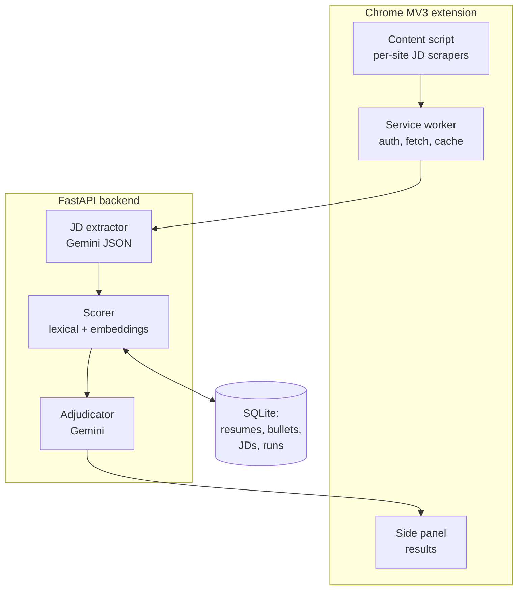

# Resume Matcher Chrome Extension: Build Plan

2026-09-20 · @Someone

Build it on the Chrome extension you already shipped, not on JobFit. The extension shell is the harder half and AI\_Scanner\_Extension already does the exact thing this needs: read a page, call Gemini for structured JSON, show the result. JobFit becomes the scoring service behind it.

## What it does

You are on a job posting. You click the extension. Within about 15 seconds you see which of your resume bases to use, how well it covers the posting, what is missing, and whether you should tailor a variant.


The panel answers four questions in order: which base, how good a fit, what is missing, and what to change. The fourth is the one no existing tool does, because it needs your bullet bank, not just your resume.

## What you already built that this reuses

Most of this exists. The new code is the scoring layer and the panel.

| You have | In | Becomes |
| --- | --- | --- |
| MV3 popup, background service worker, viewer page | AI\_Scanner\_Extension | The extension shell, unchanged in shape |
| Gemini REST call with `responseMimeType: application/json` | AI\_Scanner\_Extension | JD requirement extraction, same pattern |
| Demo-results fallback when the API is unreachable | AI\_Scanner\_Extension | Offline mode, so a dead key never blocks you |
| FastAPI service, Dockerized | jobfit | The scoring backend |
| spaCy extraction, SBERT similarity, Gemini recommendations | jobfit | Three of the four scoring layers |
| Weighted score (skills 35, responsibilities 20, title 15, semantic 30) | jobfit | The starting weights, retuned for multi-resume ranking |
| PyPDF2 parsing, BeautifulSoup scraping | jobfit | Resume ingest and the ATS parse check |

What JobFit does not do: it scores one resume against one job. You need one job against N resumes, ranked, with per-requirement evidence. That is a different query shape and the main thing to build.

## Architecture

Three pieces: extension, backend, store. Keep the Gemini key in the backend, never in the extension. An MV3 extension ships its source to every user, and even for a private one a key in the bundle leaks through the dev tools of any page you open.



Run the backend locally at first (`localhost:8000`, listed in `host_permissions`). When you want it on your phone or a second machine, put it on Fly.io or Railway behind a single bearer token you paste into the extension's options page.

Use Chrome's side panel API rather than a popup. A popup closes when you click the page, which you will do constantly while comparing the posting to the panel.

## The matching engine

Four layers. Each one alone is weak; the combination is what makes the answer trustworthy.

**1. Extract requirements, do not embed the whole posting.** Send the JD to Gemini with a JSON schema and get back a list of requirements, each with `text`, `kind` (language, framework, concept, domain, soft), `required` or `preferred`, and a `weight` of 1 to 3. Postings bury the real requirements in boilerplate about culture and benefits; embedding the whole thing dilutes everything that matters.

**2. Score each requirement against each resume three ways.** Lexical exact match with a synonym map (ETL matches ELT; MCP matches Model Context Protocol; CV matches computer vision). Embedding similarity with the SBERT model JobFit already loads. Then a per-requirement verdict: covered in a bullet, covered in skills only, or missing.

**3. Combine into a per-resume score.**

```latex
score = \frac{\sum_{r \in R} w_r \cdot c_r \cdot p_r}{\sum_{r \in R} w_r}
```

Where `w` is the requirement's weight (required counts double preferred), `c` is coverage from 0 to 1, and `p` is a placement multiplier: 1.0 if the evidence is in an experience or project bullet, 0.6 if it only appears in the skills section. That multiplier is the honest part. A recruiter reading your resume believes a skills row much less than a bullet with a number in it.

**4. Adjudicate with one LLM call, not N.** Send the top three resumes' bullets plus the requirement list and ask for the ranking, the two strongest matched bullets per resume, and gaps that the lexical layer scored as missing but a human would count as covered. One call, not one per resume, keeps latency near 10 seconds and cost near nothing.

The synonym map is the thing you will keep editing. Seed it from the nine keyword research files you already have, since those list the real market vocabulary per family.

## The ATS score, honestly

There is no such thing as an ATS score you can compute. Workday, Greenhouse, Taleo and iCIMS do not rank resumes 0 to 100 and reject below a line. They parse the file into fields and let a recruiter filter and search. The "87% ATS match" that Jobscan and its imitators show is a keyword overlap percentage with a marketing label.

So compute two things and name them for what they are.

**Requirement coverage.** The score above, shown as a percentage with the requirement list behind it. Every point traces to a requirement and the bullet that covers it. That is defensible and it is what the recruiter's keyword search actually approximates.

**Parse check.** Run the PDF through a parser in the backend and assert: name and email extracted, section headings detected, every bullet survives as text, dates parse as dates, no character that breaks tokenization. This is the part that genuinely sinks resumes, and almost no tool checks it. Your resumes already pass, since they are plain markdown rendered to text, but this catches the day you paste in something with a table or a text box.

Show them as two separate numbers. Never blend them into one number called an ATS score.

## Getting the resume library in

This is the unglamorous part that decides whether the tool is useful. resume.lol has no public API, so the corpus has to get into the backend some other way.

Do not ingest all 130-plus company resumes. Index the nine role-family bases plus a bullet bank. Company variants are derived from those anyway, and scoring 130 near-identical documents produces a ranked list where the top twenty differ by noise.

Three ways in, in the order worth trying:

1. **Export once, commit to the repo.** Pull each base as markdown through the resume.lol MCP tools in a Claude session, write them to `resumes/*.md`, and have the backend load the folder on boot. Re-export when a base changes. Zero integration work and the library becomes version-controlled, which it currently is not.
2. **A paste box in the options page.** Paste markdown, it posts to the backend. Good enough when you build a base at 1am and want it indexed immediately.
3. **Scrape your own resume.lol dashboard** from a content script while you are logged in. Tempting and fragile. Their DOM changes and you are back to option 1.

The bullet bank matters more than the resumes. Store every bullet as its own row with its source (Mooremac, EVL, Recall), the families it fits, and the keywords it carries. The evidence ledger from this session is already exactly that, just in markdown. Then "which bullets should I swap in" becomes a query instead of a judgment call.

## Build phases

| Phase | Scope | Done when |
| --- | --- | --- |
| P0, one weekend | Extension shell forked from AI\_Scanner\_Extension, one scraper (Greenhouse or Lever, static HTML, no login), JD extraction via Gemini, 9 bases loaded from a folder, lexical scoring only, panel shows ranked list and missing requirements | You paste a Greenhouse URL and get the right base back |
| P1, next weekend | SBERT layer, placement multiplier, LLM adjudication, bullet-bank swap suggestions, parse check, LinkedIn and Ashby scrapers | The panel tells you what to change, not just what to use |
| P2, later | Workday and iCIMS scrapers, run history, outcome tracking, auto-append to the application map, a diff view between the base and the suggested tailoring | You stop keeping the application log by hand |

P0 is genuinely a weekend because you are not writing the extension shell or the Gemini JSON plumbing. You are writing a scraper, a scoring function and a list view.

Build the backend first and test it with saved JD text files. The extension is the last thing to wire up, not the first. Debugging a scoring bug through a service worker is miserable.

## Gotchas that will cost real time

- **Workday postings live in iframes** with generated class names and lazy-loaded description panes. Leave Workday for P2 and add a "paste the JD" fallback box so no site can block you entirely.
- **LinkedIn truncates the description** behind a "see more" button and rewrites the DOM on navigation. Your scraper has to click it and re-run on route change, not on page load.
- **Do not put the Gemini key in the extension.** Backend only, with a bearer token in the options page.
- **Cache by JD hash.** You will click the same posting five times while tailoring. A hash-keyed cache turns four of those into free instant results.
- **The adjudicator will invent gaps.** Constrain it to the requirement list and have it cite the bullet id it matched. If it cannot cite one, the requirement is missing, no argument.
- **Ranking near-identical resumes is noise.** If the top two are within about 3 points, say "either, here is what differs" rather than pretending to a winner.
- **Scores drift as you edit bases.** Store the resume version with each run, or last month's numbers will quietly stop meaning anything.
- **Chrome Web Store review** is not worth it for a personal tool. Load it unpacked in developer mode.
